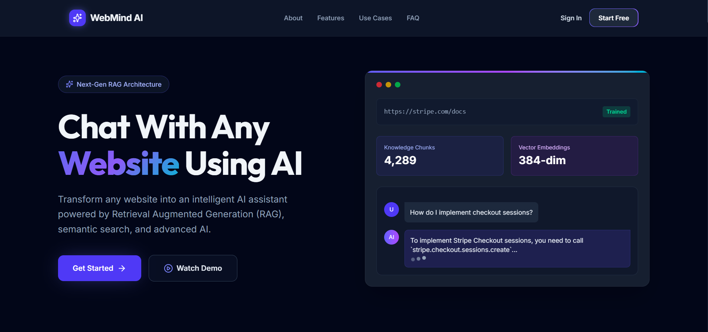
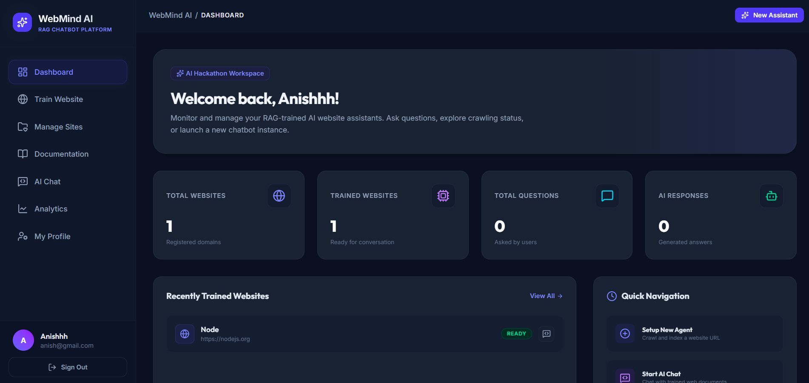
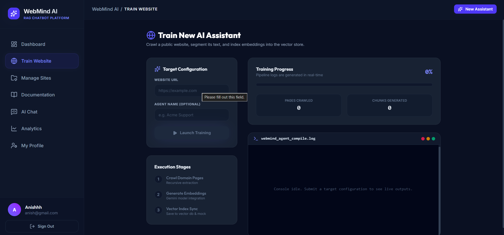
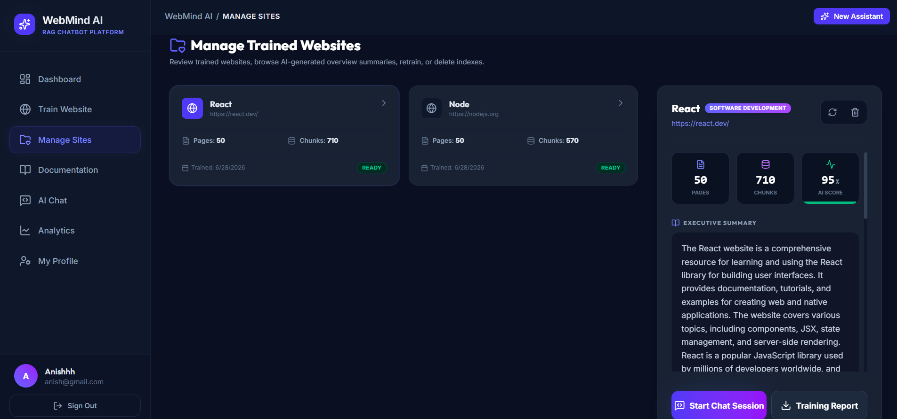
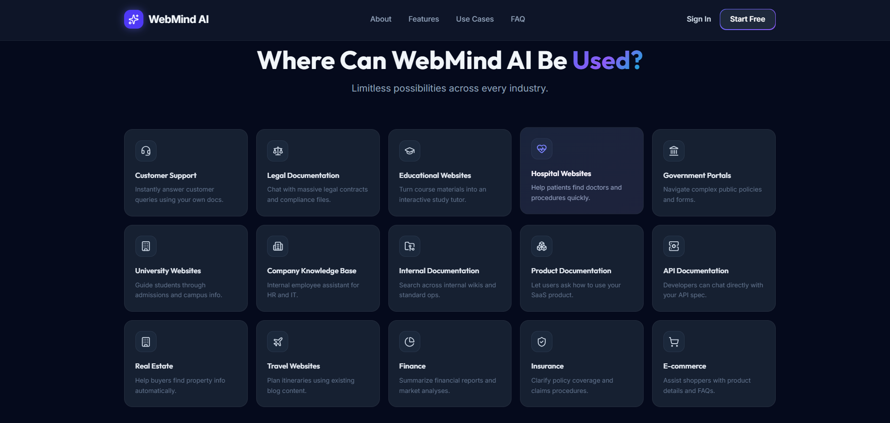
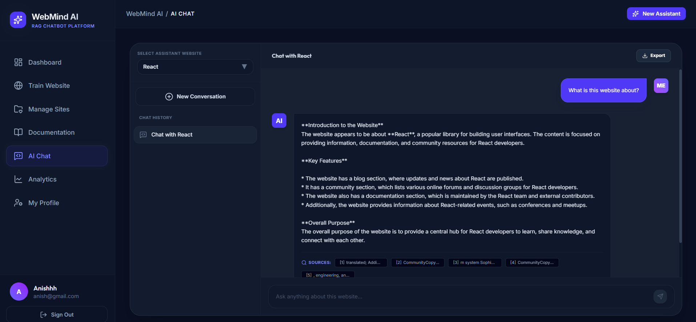
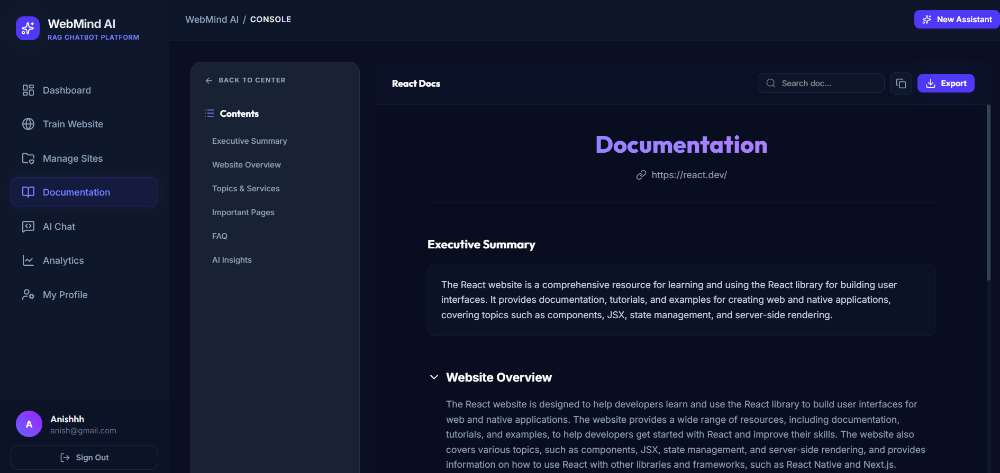
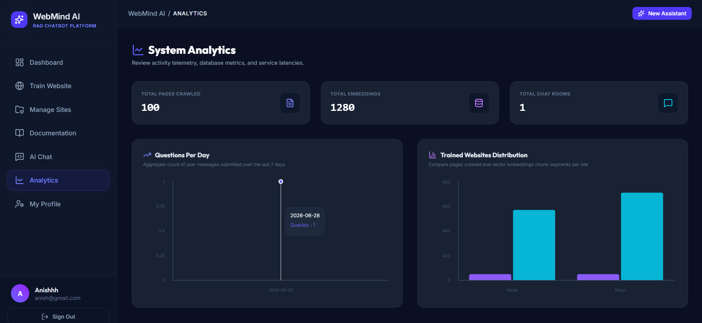
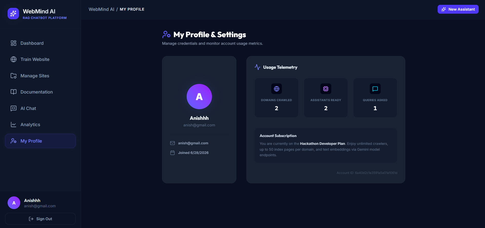
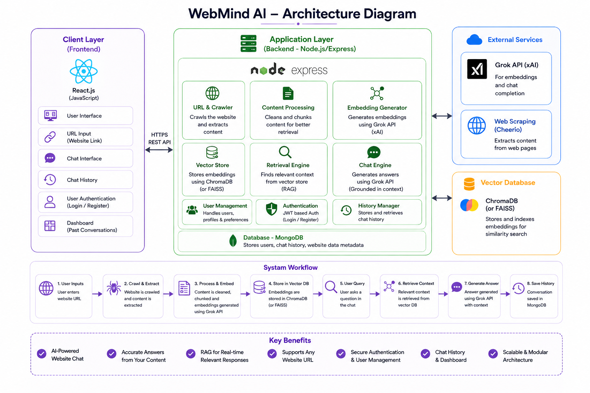

<!-- # WebMind AI — Grounded RAG Website Chatbot

WebMind AI is a full-stack RAG (Retrieval-Augmented Generation) platform that transforms static website URLs into conversational AI assistants. Users can submit URLs, crawl them recursively, generate semantic text chunk embeddings using Google's Gemini API, store vectors in ChromaDB (with a fallback search engine in MongoDB), and interact with a grounded chatbot complete with source citations, charts, and administrative analytics.

---

## 🚀 Key Features

*   **Recursively Crawler**: Dual-engine crawler (Fast `cheerio` parsing with a headless browser `puppeteer` fallback for JavaScript-heavy single-page apps) targeting the same domain (max 50 pages).
*   **Semantic Segmentation**: Clean text chunking with overlay buffers (800 chars, 150 chars overlap) to retain contextual continuity.
*   **Google Gemini RAG Pipeline**:
    *   Generates a structured website summary (Executive Summary, Topics, Services, Key Info) returned in clean JSON.
    *   Generates grounded chat answers using `gemini-1.5-flash` model context restrictions (prevents hallucinations).
*   **Dual-Mode Vector Store**:
    *   **ChromaDB Mode**: High-performance local index store using `@chromadb/chromadb`.
    *   **MongoDB Fallback Mode**: If ChromaDB is unavailable or unconfigured, the system automatically falls back to MongoDB chunk storage and calculates cosine vector similarity in-memory using JavaScript.
*   **Server-Sent Events (SSE) Streaming**: Chatbot responses stream chunk-by-chunk to the client in real-time, displaying grounding source citations alongside the text.
*   **Premium Visual Dashboard**: Dark slate aesthetic accented with indigo, purple, and cyan glassmorphism panels. Features interactive Recharts analytics, system logs, quick-links, and responsive controls.

---

## 🛠️ Technology Stack

*   **Backend**: Node.js, Express, MongoDB (Mongoose), Google Gemini API (`@google/generative-ai`), ChromaDB (`chromadb`), Cheerio, Puppeteer.
*   **Frontend**: React (v19), Vite (v8), Tailwind CSS (v4), Axios, Lucide React, Recharts, React Router.

---

## 📂 Codebase Directory Structure

```text
d:\WebMind\
├── backend/
│   ├── config/
│   │   └── db.js                  # MongoDB Mongoose connection
│   ├── controllers/
│   │   ├── analyticsController.js # Aggregations for user activity charts
│   │   ├── authController.js      # User registration, login, and profile metrics
│   │   ├── chatController.js      # Conversations history, chat response, and SSE streaming
│   │   └── websiteController.js   # Background web training pipeline orchestration
│   ├── middleware/
│   │   └── authMiddleware.js      # Express JWT validation middleware
│   ├── models/
│   │   ├── Chunk.js               # Embeddings chunk schema
│   │   ├── Conversation.js        # Chat sessions tracking
│   │   ├── CrawledPage.js         # Raw HTML-extracted page contents
│   │   ├── Message.js             # Chat messages with citations array
│   │   ├── User.js                # Encrypted login profile
│   │   └── Website.js             # Website status, pages count, and summaries
│   ├── routes/
│   │   ├── analyticsRoutes.js
│   │   ├── authRoutes.js
│   │   ├── chatRoutes.js
│   │   └── websiteRoutes.js
│   ├── services/
│   │   ├── crawlerService.js      # Recursive cheerio scraper and Puppeteer fallback
│   │   ├── embeddingService.js    # Gemini API text-embedding-004 vector creator
│   │   ├── geminiService.js       # Grounded prompt template and generative responses
│   │   └── vectorStoreService.js  # Dual index orchestrator (ChromaDB + MongoDB similarity fallback)
│   ├── tests/
│   │   └── verifyServices.js      # Local validation script for core pipeline
│   ├── .env                       # Local secrets (PORT, MONGODB_URI, GEMINI_API_KEY, etc.)
│   ├── package.json
│   └── server.js                  # Entry point
└── frontend/
    ├── src/
    │   ├── components/            # protected routes, loading widgets, toast messages
    │   ├── context/
    │   │   └── AuthContext.jsx    # React state holding login profile/tokens
    │   ├── layouts/
    │   │   └── DashboardLayout.jsx# Responsive sidebar navigation framework
    │   ├── pages/
    │   │   ├── LandingPage.jsx    # Glowing marketing landing page
    │   │   ├── Login.jsx / Register.jsx
    │   │   ├── Dashboard.jsx      # Activity charts and quick access actions
    │   │   ├── WebsiteTraining.jsx# Real-time console logs during URL crawling
    │   │   ├── WebsiteManagement.jsx
    │   │   ├── ChatInterface.jsx  # Grounded chat board with collapsible sources sidebar
    │   │   └── Analytics.jsx      # Recharts graphs covering requests over time
    │   ├── services/
    │   │   └── api.js             # Axios base connector
    │   ├── App.jsx                # Router endpoints mapping
    │   └── index.css              # Custom Tailwind v4 styling theme and animations
    ├── vite.config.js
    ├── postcss.config.js
    └── package.json
```

---

## ⚙️ Installation & Configuration

### Prerequisites

*   **Node.js**: v18 or higher recommended.
*   **MongoDB**: Run locally or configure a connection string (e.g. MongoDB Atlas).
*   **ChromaDB** *(Optional)*: If running ChromaDB locally on port `8000`, the server will index vectors directly. If not running, it automatically switches to MongoDB vector calculations.

### Backend Setup

1. Navigate to the backend directory:
   ```bash
   cd backend
   ```
2. Install dependencies:
   ```bash
   npm install
   ```
3. Create a `.env` file from the example:
   ```bash
   cp .env.example .env
   ```
4. Update the `.env` settings:
   ```env
   PORT=5000
   MONGODB_URI=mongodb://localhost:27017/webmind
   JWT_SECRET=your_jwt_secret_key_here
   GEMINI_API_KEY=your_google_gemini_api_key
   CHROMA_URL=http://localhost:8000
   NODE_ENV=development
   ```

### Frontend Setup

1. Navigate to the frontend directory:
   ```bash
   cd ../frontend
   ```
2. Install dependencies:
   ```bash
   npm install
   ```
3. Start the development build:
   ```bash
   npm run dev
   ```
   The Vite interface will start running on `http://localhost:5173`.

---

## 🧪 Testing and Verification

### Services Validation Script
A mock script is provided to verify chunking, cosine vector matching, and crawler extraction outside the API layer:
```bash
cd backend
node tests/verifyServices.js
```

### Running Locally
To test the web flow:
1. Start the backend: `npm run start` or `npm run dev` in `backend/`.
2. Start the frontend: `npm run dev` in `frontend/`.
3. Open `http://localhost:5173/` in a browser.
4. Register a test user, train on `https://example.com`, and test grounding capabilities. -->


# 🚀 WebMind AI

<p align="center">



</p>

<h3 align="center">
AI-Powered RAG Website Chatbot Platform
</h3>

<p align="center">
Transform any website into an intelligent AI assistant using Retrieval-Augmented Generation (RAG), semantic search, and Google Gemini.
</p>

# 📌 Project Overview

WebMind AI is a modern SaaS platform that allows users to train AI on any public website.

Simply provide a website URL.

The system automatically:

• Crawls the website

• Extracts content

• Splits into chunks

• Generates embeddings

• Stores vectors

• Creates an AI assistant

• Lets users chat with the website using RAG.


# 🎯 Problem Statement

Businesses, educational institutions, and organizations often have large websites containing hundreds of pages of information. Users spend significant time manually searching through documentation, FAQs, blogs, and support pages to find the answers they need.

Traditional keyword-based search systems frequently fail to understand user intent, resulting in irrelevant search results and poor user experience.

Organizations also face challenges in providing instant, accurate, and scalable customer support without increasing operational costs.

Current solutions require users to manually identify:

• Relevant web pages
• Product documentation
• Frequently asked questions
• Support articles
• Technical documentation
• Policies and procedures
• Knowledge base content

This process is repetitive, time-consuming, inefficient, and often leads to user frustration.


# 💡 Solution

WebMind AI is an AI-powered platform that transforms any public website into an intelligent chatbot using **Retrieval-Augmented Generation (RAG)**. Instead of relying on traditional keyword-based search, the platform crawls website content, processes and indexes it into a vector database, and enables users to interact with the website through natural language conversations. By combining semantic search with Google Gemini, WebMind AI delivers fast, accurate, and context-aware responses based solely on the website's content, providing a smarter and more efficient way to access information.

The platform provides the following capabilities:

- 🌐 Crawls and extracts content from public websites.
- 🧹 Cleans and preprocesses HTML to obtain meaningful text.
- ✂️ Splits content into optimized text chunks for efficient retrieval.
- 🧠 Generates high-quality vector embeddings using Gork.
- 🗄️ Stores embeddings in a ChromaDB vector database.
- 🔍 Performs semantic similarity search to retrieve the most relevant content.
- 🤖 Generates context-aware answers using Google Gemini and RAG.
- 💬 Provides an AI chatbot for interactive conversations with website content.
- 📄 Generates executive summaries and AI-powered documentation.
- 📊 Displays website analytics, training statistics, and chatbot usage insights.
- 🔐 Supports secure user authentication and personalized dashboards.


# ✨ Features

✅ Website Crawling
✅ Automatic Content Extraction
✅ AI Generated Embeddings
✅ Vector Database Storage
✅ Semantic Search
✅ Gork Integration
✅ AI Chat Assistant
✅ Documentation Generator
✅ Website Analytics
✅ Authentication
✅ User Dashboard
✅ Training Progress
✅ Responsive UI
✅ MongoDB Atlas
✅ JWT Authentication
✅ Chat History
✅ Executive Summary
✅ Training Report
✅ Multi-page Website Support


# 🖼 Screenshots

## Landing Page


---

## Dashboard



---

## Train Website



---

## Manage Sites



---

## Usecase



---

## AI Chat



---

## Documentation



---

## Analytics



---

## Profile




# 🏗 System Architecture



## Architecture Overview

The system follows a modern client-server architecture powered by **Retrieval-Augmented Generation (RAG)** to transform any public website into an intelligent AI chatbot. It combines website crawling, semantic search, vector embeddings, and the **Groq LLM** to provide fast, accurate, and context-aware responses.

### 1. React Frontend

- Built using **React.js**, **Vite**, and **Tailwind CSS**.
- Provides an intuitive interface for training websites and chatting with AI.
- Displays dashboard statistics, analytics, documentation, and user profile.
- Handles routing, authentication, and API communication.

### 2. Node.js & Express Backend

- Receives website URLs submitted by users.
- Manages authentication and REST API endpoints.
- Coordinates the complete RAG training pipeline.
- Connects the frontend with MongoDB, ChromaDB, and the Groq API.

### 3. Website Crawler (Cheerio)

- Crawls the submitted website recursively.
- Extracts meaningful text from HTML pages.
- Removes scripts, styles, navigation menus, and unnecessary content.
- Collects clean website data for AI processing.

### 4. Text Processing & Chunking

- Cleans extracted website content.
- Splits large documents into smaller chunks.
- Optimizes chunks for embedding generation and semantic retrieval.

### 5. Embedding Generation

- Converts text chunks into vector embeddings.
- Preserves the semantic meaning of the content.
- Prepares the data for efficient similarity search.

### 6. ChromaDB Vector Database

- Stores all generated vector embeddings.
- Performs semantic similarity search.
- Retrieves the most relevant content for user questions.
- Acts as the knowledge base for the RAG pipeline.

### 7. Groq Large Language Model (LLM)

- Receives the retrieved context from ChromaDB.
- Generates fast and context-aware responses.
- Ensures answers are grounded in the trained website content.
- Reduces hallucinations using the RAG approach.

### 8. MongoDB Atlas Database

- Stores user accounts and authentication details.
- Maintains trained website information.
- Saves chatbot sessions, documentation, analytics, and training metadata.
- Provides secure cloud-based data storage.

### 9. Generated Output

The platform provides:

- AI-powered website chatbot
- Semantic question answering
- Website executive summaries
- AI-generated documentation
- Website analytics
- Training reports
- Chat history
- Dashboard insights


# ⚙ Tech Stack

## Frontend

- React.js
- Vite
- Tailwind CSS
- Framer Motion
- Axios

## Backend

- Node.js
- Express.js
- LangChain
- Cheerio

## AI

- Gork LLM

## Vector Database

- ChromaDB

## Database

- MongoDB Atlas

## Authentication

- JWT Authentication

# 📂 Project Structure

```text
d:\WebMind\
├── backend/
│   ├── config/
│   │   └── db.js                  # MongoDB Mongoose connection
│   ├── controllers/
│   │   ├── analyticsController.js # Aggregations for user activity charts
│   │   ├── authController.js      # User registration, login, and profile metrics
│   │   ├── chatController.js      # Conversations history, chat response, and SSE streaming
│   │   └── websiteController.js   # Background web training pipeline orchestration
│   ├── middleware/
│   │   └── authMiddleware.js      # Express JWT validation middleware
│   ├── models/
│   │   ├── Chunk.js               # Embeddings chunk schema
│   │   ├── Conversation.js        # Chat sessions tracking
│   │   ├── CrawledPage.js         # Raw HTML-extracted page contents
│   │   ├── Message.js             # Chat messages with citations array
│   │   ├── User.js                # Encrypted login profile
│   │   └── Website.js             # Website status, pages count, and summaries
│   ├── routes/
│   │   ├── analyticsRoutes.js
│   │   ├── authRoutes.js
│   │   ├── chatRoutes.js
│   │   └── websiteRoutes.js
│   ├── services/
│   │   ├── crawlerService.js      # Recursive cheerio scraper and Puppeteer fallback
│   │   ├── embeddingService.js    # Gemini API text-embedding-004 vector creator
│   │   ├── geminiService.js       # Grounded prompt template and generative responses
│   │   └── vectorStoreService.js  # Dual index orchestrator (ChromaDB + MongoDB similarity fallback)
│   ├── tests/
│   │   └── verifyServices.js      # Local validation script for core pipeline
│   ├── .env                       # Local secrets (PORT, MONGODB_URI, GEMINI_API_KEY, etc.)
│   ├── package.json
│   └── server.js                  # Entry point
└── frontend/
    ├── src/
    │   ├── components/            # protected routes, loading widgets, toast messages
    │   ├── context/
    │   │   └── AuthContext.jsx    # React state holding login profile/tokens
    │   ├── layouts/
    │   │   └── DashboardLayout.jsx# Responsive sidebar navigation framework
    │   ├── pages/
    │   │   ├── LandingPage.jsx    # Glowing marketing landing page
    │   │   ├── Login.jsx / Register.jsx
    │   │   ├── Dashboard.jsx      # Activity charts and quick access actions
    │   │   ├── WebsiteTraining.jsx# Real-time console logs during URL crawling
    │   │   ├── WebsiteManagement.jsx
    │   │   ├── ChatInterface.jsx  # Grounded chat board with collapsible sources sidebar
    │   │   └── Analytics.jsx      # Recharts graphs covering requests over time
    │   ├── services/
    │   │   └── api.js             # Axios base connector
    │   ├── App.jsx                # Router endpoints mapping
    │   └── index.css              # Custom Tailwind v4 styling theme and animations
    ├── vite.config.js
    ├── postcss.config.js
    └── package.json
```

# 🚀 Installation

```bash
git clone https://github.com/Anisa-barvin/WebMind-AI.git

cd WebMind-AI

npm install
```

# 🔧 Environment Variables

Create a `.env` file.

```env
PORT=5000

MONGODB_URI=your_mongodb_connection

JWT_SECRET=your_secret

GORK_API_KEY=your_api_key
```

# ▶ Usage

1. Register/Login

2. Enter Website URL

3. Train Website

4. Generate Embeddings

5. View Executive Summary

6. Open AI Chat

7. Ask Questions

8. Download Documentation

9. View Analytics


# 📈 Future Enhancements

- Sitemap Crawling
- Image Understanding
- OCR
- Multi-language Support
- Voice Chat
- Team Workspaces
- API Integration


# 👩‍💻 Developed By

**ANISABARVIN A**

B.Tech Information Technology

Sri Shakthi Institute of Engineering and Technology

# 📄 License

This project is developed for educational and placement purposes.